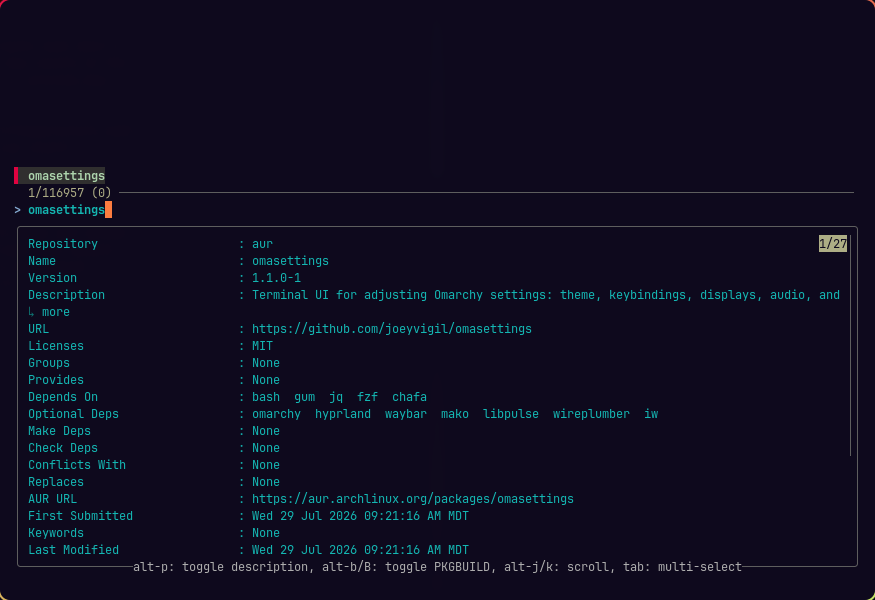

# omasettings

A terminal UI for Omarchy settings — theme, keybindings, displays, audio,
notifications, and the rest, in one menu.


## Install

```bash
omarchy pkg aur add omasettings
```

Or from source:

```bash
git clone https://github.com/joeyvigil/omasettings
cd omasettings && ./install.sh
```
Or from install menu (Super + Alt + Space -> Install -> AUR):



## Usage

```bash
omasettings              # open the menu
omasettings appearance   # jump straight to a section
omasettings search       # search every setting at once
```

Arrows move, `enter` selects, `esc` goes back.

## What it covers

| Section | |
|---|---|
| **Appearance** | theme, font, wallpaper, rounding, opacity, blur |
| **Look & Feel** | gaps, borders, tiling layout, animations |
| **Bar** | widgets, position, transparency |
| **Keybindings** | browse, search, rebind |
| **Input** | keyboard, mouse, touchpad |
| **Display** | monitors, brightness, night light, lock screen |
| **Audio** | devices, volume |
| **Network** | Wi-Fi, Bluetooth, DNS |
| **Notifications** | do-not-disturb, history |
| **Apps & Startup** | default apps, login programs, web apps |
| **Power** | profile, idle, battery, hibernation |
| **System** | updates, security, snapshots, config resets |

Every menu shows each setting's current value beside it. There is also a global
search, a view of everything you have changed from Omarchy's defaults, and a
restore picker for any backup omasettings has taken.

## Omarchy 3 and 4

Both are supported, and the right one is detected at startup.

Omarchy 4 ("quattro") moved most of what this tool touches: Hyprland's config
became Lua, Waybar became the Quickshell-based Omarchy shell, and mako and
hypridle folded into that same shell. omasettings reads and writes whichever
format is actually installed, so the menus look the same on either.

## How it works

Settings Omarchy already has a command for are delegated to `omarchy ...`, so
hooks still fire. The rest are edited directly in `~/.config`, with a writer per
format — Hyprland `.conf` sections, Hyprland Lua tables, `shell.json`, Waybar
`jsonc` — each preserving the comments and layout around what it changes.
Nothing Omarchy ships is ever written to.

Files are backed up before every edit. Hyprland changes are reloaded and checked
with `hyprctl configerrors`, and offered back from the backup if they fail.

## Development

`packaging/` holds the PKGBUILDs and the AUR publishing script. `demo/` holds
the VHS tape and recorder for the GIF above.

MIT
